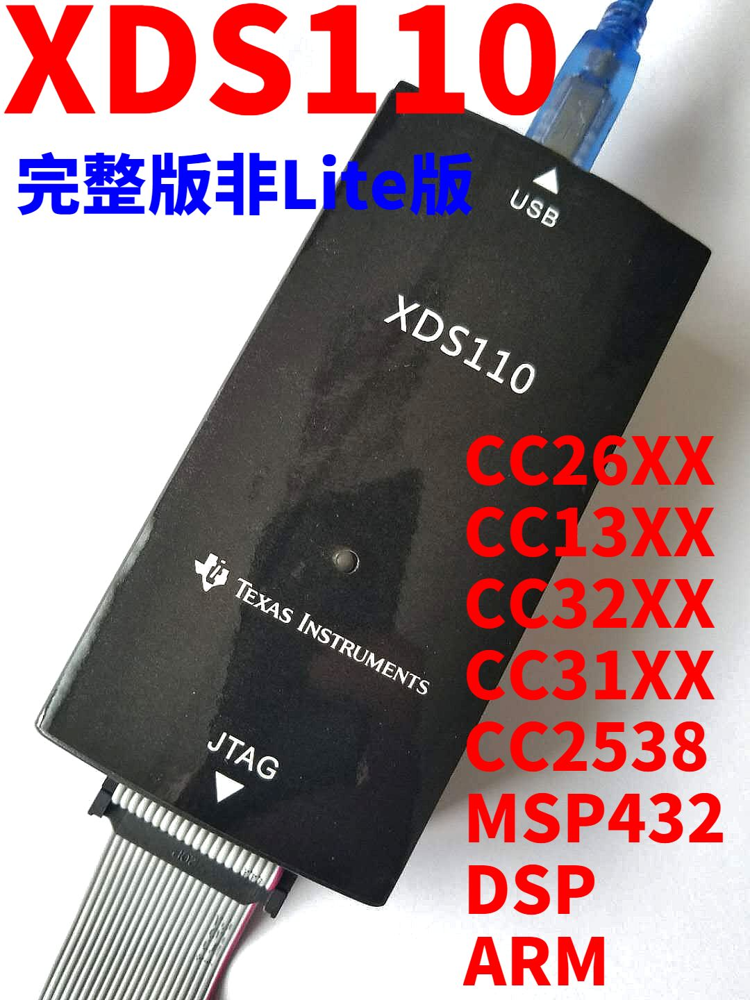

# ti-xds110-amplifier
This is a signal amplifier board for TI XDS110 clones.

Bought xds110 clone that doesn't work with your board? Here's the solution.

The problem is the tm4c1294 chip can't provide enough power to produce a stable low signal.
This board uses a fast buffer IC to amplify the signal.

Tested at normal 2.5Mhz JTAG speed.

Works only with black xds110 clone, as it has 3.3V on pin 6 which breaks the standard.

http://processors.wiki.ti.com/images/9/90/Dbjtag_users_guide.pdf
